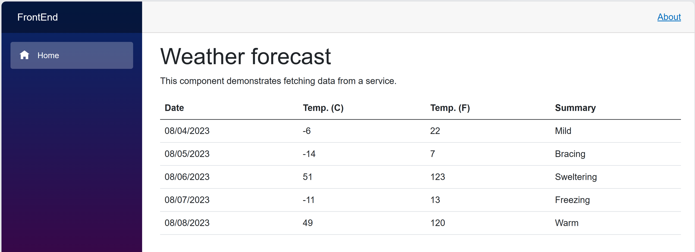
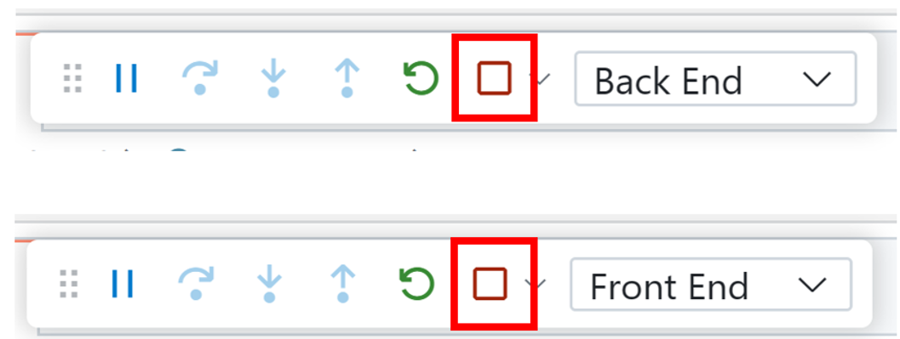

# GitHub Codespaces ♥️ .NET

Want to try out the latest performance improvements coming with .NET for web development? 

This repo builds a Weather API, OpenAPI integration to test with [Scalar](https://learn.microsoft.com/aspnet/core/fundamentals/openapi/using-openapi-documents?view=aspnetcore-9.0#use-scalar-for-interactive-api-documentation), and displays the data in a web application using Blazor with .NET. 

We've given you both a frontend and backend to play around with and where you go from here is up to you!

Everything you do here is contained within this one codespace. There is no repository on GitHub yet. If and when you're ready you can click "Publish Branch" and we'll create your repository and push up your project. If you were just exploring then and have no further need for this code then you can simply delete your codespace and it's gone forever.

## 📚 Documentation

- **[API Documentation](API.md)** - Detailed API endpoint reference
- **[Architecture Guide](ARCHITECTURE.md)** - Technical architecture overview
- **[Development Guide](DEVELOPMENT.md)** - Setup and development workflow
- **[Contributing Guide](CONTRIBUTING.md)** - How to contribute to this project

## ✨ Features

- **Backend API**: ASP.NET Core 9.0 Minimal APIs with weather and sunset endpoints
- **Frontend**: Blazor Server-Side application for displaying weather data
- **Interactive API Docs**: Scalar UI for testing and exploring the API
- **OpenAPI Support**: Auto-generated API documentation
- **Dev Container**: Fully configured development environment
- **Hot Reload**: Instant feedback during development
- **GitHub Codespaces**: One-click cloud development environment

## 🛠️ Technology Stack

- **.NET 9.0**: Latest .NET framework
- **ASP.NET Core**: High-performance web framework
- **Blazor**: Modern web UI framework
- **OpenAPI/Scalar**: API documentation and testing
- **GitHub Codespaces**: Cloud development environment

### Run Options

[](https://codespaces.new/github/dotnet-codespaces)
[](https://vscode.dev/redirect?url=vscode://ms-vscode-remote.remote-containers/cloneInVolume?url=https://github.com/github/dotnet-codespaces)

You can also run this repository locally by following these instructions: 
1. Clone the repo to your local machine `git clone https://github.com/github/dotnet-codespaces`
1. Open repo in VS Code

## 🚀 Getting Started

1. **📤 One-click setup**: [Open a new Codespace](https://codespaces.new/github/dotnet-codespaces), giving you a fully configured cloud developer environment.
2. **▶️ Run all, one-click again**: Use VS Code's built-in *Run* command and open the forwarded ports *8080* and *8081* in your browser. 


3. The Blazor web app and Scalar can be open by heading to **/scalar** in your browser. On Scalar, head to the backend API and click "Test Request" to call and test the API. 




4. **🔄 Iterate quickly:** Codespaces updates the server on each save, and VS Code's debugger lets you dig into the code execution.

5. To stop running, return to VS Code, and click Stop twice in the debug toolbar. 



## 📖 Quick Reference

### Project Structure
```
dotnet-codespaces/
├── SampleApp/
│   ├── BackEnd/          # Weather API (Port 8080)
│   ├── FrontEnd/         # Blazor Web App (Port 8081)
│   └── SampleApp.sln
├── .devcontainer/        # Dev container configuration
└── .vscode/              # VS Code settings and launch configs
```

### API Endpoints

The backend provides the following endpoints:

- **GET /weatherforecast** - Get 5-day weather forecast
- **GET /sunset?date={date}** - Get sunset time for a date
- **GET /sunset/range?startDate={date}&days={number}** - Get sunset times for multiple days
- **GET /scalar** - Interactive API documentation

For detailed API documentation, see [API.md](API.md).

### Development Commands

```bash
# Build the solution
dotnet build SampleApp/SampleApp.sln

# Run backend
cd SampleApp/BackEnd && dotnet run

# Run frontend (requires WEATHER_URL env variable)
cd SampleApp/FrontEnd && dotnet run

# Watch mode (hot reload)
dotnet watch run
```

For more development information, see [DEVELOPMENT.md](DEVELOPMENT.md).

## 🏗️ Architecture

This application uses a simple client-server architecture:

- **Frontend (Blazor)**: Server-side Blazor application that renders UI and communicates with the backend
- **Backend (ASP.NET Core)**: RESTful API using Minimal APIs pattern with OpenAPI documentation

For detailed architecture information, see [ARCHITECTURE.md](ARCHITECTURE.md).

## 🤝 Contributing

This project welcomes contributions and suggestions. Most contributions require you to agree to a
Contributor License Agreement (CLA) declaring that you have the right to, and actually do, grant us
the rights to use your contribution. For details, visit https://cla.opensource.microsoft.com.

When you submit a pull request, a CLA bot will automatically determine whether you need to provide
a CLA and decorate the PR appropriately (e.g., status check, comment). Simply follow the instructions
provided by the bot. You will only need to do this once across all repos using our CLA.

For detailed contribution guidelines, see [CONTRIBUTING.md](CONTRIBUTING.md).

This project has adopted the [Microsoft Open Source Code of Conduct](https://opensource.microsoft.com/codeofconduct/).
For more information see the [Code of Conduct FAQ](https://opensource.microsoft.com/codeofconduct/faq/) or
contact [opencode@microsoft.com](mailto:opencode@microsoft.com) with any additional questions or comments.

## 📝 License

This project may contain trademarks or logos for projects, products, or services. Authorized use of Microsoft 
trademarks or logos is subject to and must follow 
[Microsoft's Trademark & Brand Guidelines](https://www.microsoft.com/en-us/legal/intellectualproperty/trademarks/usage/general).
Use of Microsoft trademarks or logos in modified versions of this project must not cause confusion or imply Microsoft sponsorship.
Any use of third-party trademarks or logos are subject to those third-party's policies.

## 🔗 Additional Resources

- [ASP.NET Core Documentation](https://learn.microsoft.com/aspnet/core/)
- [Blazor Documentation](https://learn.microsoft.com/aspnet/core/blazor/)
- [.NET 9 Documentation](https://learn.microsoft.com/dotnet/core/whats-new/dotnet-9)
- [GitHub Codespaces Documentation](https://docs.github.com/codespaces)
- [Scalar API Documentation](https://github.com/scalar/scalar)
